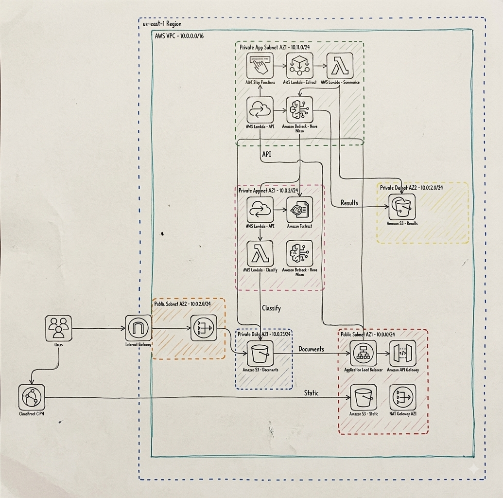
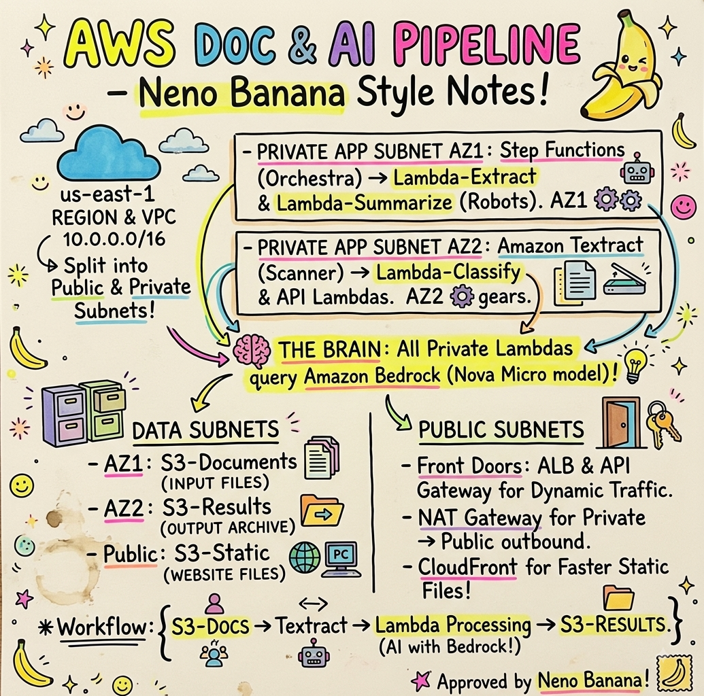

# Cornerstone AI

**An AI assistant that reads construction paperwork for you.**

## What is this?

Imagine you run a construction company and every day someone on your team has to open dozens of PDFs — invoices from suppliers, building permits, change orders, inspection requests — read through them, and manually type the important details (amounts, dates, names) into a spreadsheet or project tracker.

Cornerstone AI does that reading for you. You upload a document, and within seconds it tells you:
- **What kind of document it is** (invoice, permit, change order, etc.)
- **A plain-English summary** of what it says
- **The important numbers and names** pulled out automatically (vendor, amount, dates, permit number...)
- **A heads-up if something looks off** — like a missing signature or an unusually large amount — so a human can double-check before it's approved

Nothing is auto-approved. Every result is marked "pending human review" — this tool does the tedious reading, a person still makes the final call.

## How it works (in plain terms)

1. You drag a document onto a web page.
2. The computer "reads" the document using a text-recognition service (the same kind of technology that scans receipts or passports).
3. An AI model looks at that text and figures out what type of document it is and what the key details are.
4. You get back a tidy summary instead of a wall of PDF text.

Behind the scenes this runs entirely on Amazon Web Services (AWS) — no servers to manage, nothing running when nobody's using it.

## Architecture

**Where this could grow** — the diagram below is a target/future-state design for a production-hardened deployment (private subnets, load balancer, NAT/CloudFront, tighter network isolation), not what's running now. It's a useful reference for what "harden this for a real enterprise" looks like, but don't take it as documentation of the current MVP:



An animated walkthrough of the same target-state design:


And a sketch-note summary of the same design, subnet-by-subnet:



## What does it cost?

This is genuinely cheap — here's the honest breakdown:

| What | Cost |
|---|---|
| Sitting idle (nobody using it) | **$0** — nothing runs unless you upload a document |
| Reading one document (text extraction) | about **$0.0015** (a tenth of a cent) per page |
| AI analysis of one document | about **$0.0001** (a hundredth of a cent) |
| **Total per document** | **roughly 2 hundredths of a cent** |

To put that in perspective: processing **1,000 documents** would cost less than **$2 total**. There's no monthly subscription fee, no "keep the lights on" cost — you only pay for the exact documents you process.

## Can we use a free AI model?

Short answer: **not entirely free, but about as close as it gets.** Amazon doesn't offer any AI model on AWS for $0 — every model is billed per use, even the cheapest ones. What this project does instead is use **the cheapest model AWS offers** (Amazon Nova Micro), which is why the cost above is a fraction of a cent rather than dollars. We compared it against pricier alternatives (including Anthropic's Claude models) and picked the option where the cost is effectively a rounding error.

If you wanted a literally $0-cost option, the only way is to run an AI model on your own computer instead of AWS (using free open-source tools) — but that means your own machine does the work instead of the cloud, and it's a different setup entirely from what's built here.

## Who would actually use this?

- **A construction company's back office**, so someone doesn't have to manually retype every invoice that comes in
- **A project manager** who wants a quick summary of a permit or change order without reading the whole document
- **A finance/accounts team** flagging invoices that look unusual (wrong totals, missing info) before they're paid
- **Any team drowning in paperwork** who wants a "read this for me and tell me what matters" tool

## What it's built with (for the curious)

Amazon Textract (reads the document), Amazon Bedrock (the AI model), AWS Lambda + Step Functions (the behind-the-scenes plumbing), and Amazon S3 (storage) — all "serverless," meaning AWS only spins up compute for the few seconds it's actually needed.

## Interesting engineering challenges (for the technically curious)

This wasn't just designed on paper — it was deployed, broken, and fixed against a real AWS account. A few genuinely interesting bugs turned up along the way that wouldn't show up in a mocked/local test:

- **Text extraction silently failed on real multi-page PDFs.** Amazon Textract's *synchronous* API only supports single-page documents — it worked perfectly on our single-page test samples and then broke the moment a real 2-page document came through. Fixed by switching to Textract's *asynchronous* job API (submit a job, poll until done), which handles documents of any length.
- **A storage permission gap that hid itself.** When checking "is this document done yet?", a missing permission caused Amazon S3 to return "access denied" instead of the expected "not found yet" — because S3 deliberately won't tell an under-permissioned caller whether something exists or not, as a security measure. That subtlety crashed the status check on every single request until it was traced through the logs and fixed with one added permission.
- **The cheapest AI model needed a special routing ID.** Amazon Nova Micro (the AI model used here) rejected direct on-demand requests and required an "inference profile" ID instead — and once that was fixed, the permissions had to be granted across *three* AWS regions the profile can route through, not just one.
- **A classic web security rule (CORS) blocked file uploads** until the storage bucket was explicitly told which websites are allowed to upload to it — a standard, expected step that's easy to miss on a first deploy.

None of these were caught by writing the code carefully — they only surfaced by actually deploying and testing against the real thing, which is the whole reason this got shipped end-to-end instead of stopping at "the Terraform looks right."

## Current status

This is a working prototype — the code is fully built and tested, but it isn't running live right now (it was intentionally shut down after testing to avoid any ongoing cost). It can be turned back on in a few minutes whenever needed.

## Running this yourself on AWS

Everything here is provisioned by Terraform — there's no manual clicking around the AWS console required. All commands below assume you're in the repo root unless noted.

### 1. Prerequisites

- An AWS account with billing enabled, and credentials configured locally (`aws configure`, or an SSO profile — anything the AWS CLI/Terraform AWS provider can pick up).
- [Terraform](https://developer.hashicorp.com/terraform/install) >= 1.5.0.
- The AWS CLI (used below to confirm things after deploy; not strictly required by Terraform itself).
- Python 3.12, only if you want to run the local tests (Lambda code and packaging don't need it on your machine — Terraform zips the Lambdas itself).

### 2. Enable Bedrock model access (one-time, per AWS account)

AWS keeps foundation models opt-in per account/region. Before deploying, go to the **Bedrock console → Model access** and enable **Amazon Nova Micro** in `us-east-1` (the default region this project deploys to — see `terraform/variables.tf`). This is a one-time toggle and takes effect immediately; skipping it makes the `classify` and `summarize` Lambdas fail with an access-denied error the first time a document is processed.

### 3. Clone and deploy

```bash
git clone https://github.com/Hardikrepo/cornerstone-ai.git
cd cornerstone-ai/terraform

terraform init
terraform plan    # review what will be created
terraform apply   # type "yes" to confirm
```

No `.tfvars` file is needed to get a working deployment — every variable in `terraform/variables.tf` (region, project name, Bedrock model ID, Lambda timeouts) has a sensible default. Override any of them with `-var="aws_region=us-west-2"` or a `terraform.tfvars` file if you want a different setup.

A fresh `apply` takes a couple of minutes and creates: two S3 buckets (private `documents` bucket, public `frontend` website bucket), four Lambda functions (`api`, `extract`, `classify`, `summarize`), the Step Functions state machine that chains them, an HTTP API Gateway in front of the `api` Lambda, and the IAM roles/policies tying it together.

### 4. Get the URLs and try it

```bash
terraform output
```

This prints `frontend_url` (the web UI) and `api_base_url` (the HTTP API it talks to) — `frontend.tf` bakes `api_base_url` straight into the deployed `config.js`, so the two are already wired together with no manual step. Open `frontend_url` in a browser and drag in one of the sample PDFs from `sample_docs/` (`invoice_sample.pdf`, `permit_sample.pdf`, `change_order_sample.pdf`) to see the pipeline run end to end.

### 5. Test the pipeline logic without touching AWS

```bash
pip install boto3
python tests/test_local_pipeline.py
```

This runs the `classify` and `summarize` Lambda code locally against a mocked Bedrock client — useful for checking the data flow and JSON parsing without any AWS credentials or spend. It doesn't exercise the `extract` (Textract) step, since that needs a real S3 object to read.

### 6. Tear it down

```bash
cd terraform
terraform destroy   # type "yes" to confirm
```

Both S3 buckets are created with `force_destroy = true`, so `destroy` removes everything — including all object versions in the `documents` bucket — in one pass, with nothing left over to bill for. This is exactly what was done after the last round of testing (see "Current status" above).
